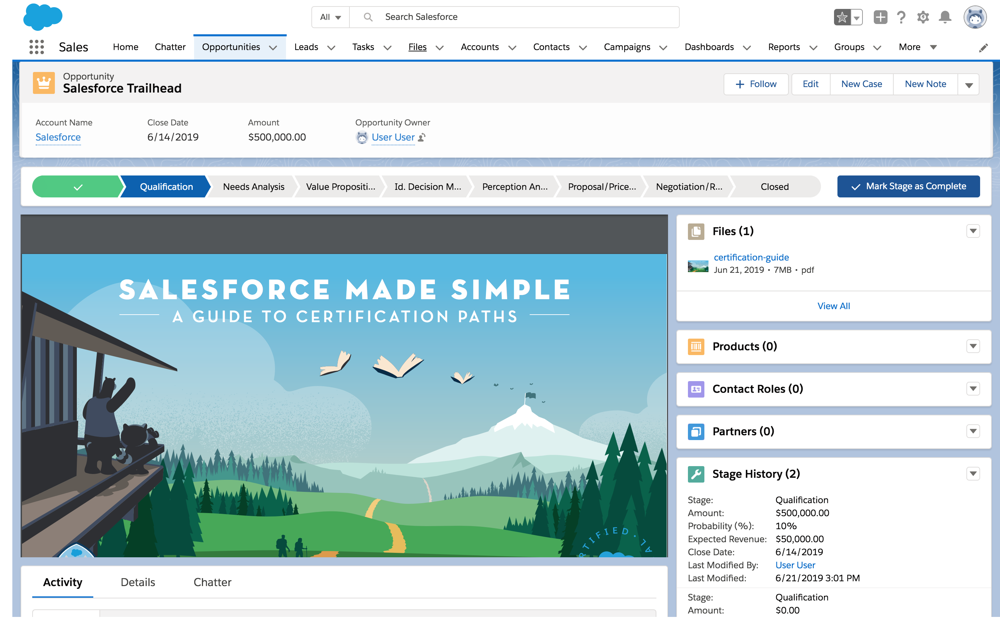
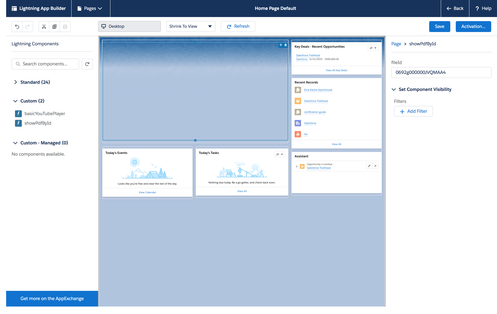
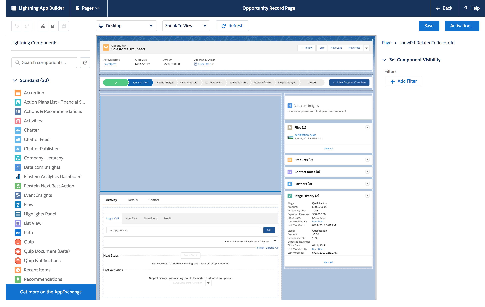

# PDF Viewer Lightning Web Component

These are two Lightning Web Components to add PDF viewing capabilities to your Salesforce page. Configure which PDF file via the Lightning App Builder. Light up your org with PDF for training, enablement, entertainment ... The possibilities are endless!

Use the **showPdfById** for Home and App pages.


Use the **showPdfRelatedToRecordId** component for Record pages.


> These components are designed to run on Salesforce Platform. If you want to experience Lightning Web Components on any platform, please visit https://lwc.dev, and try out our Lightning Web Components sample application [LWC Recipes OSS](https://github.com/trailheadapps/lwc-recipes-oss).

## Installing Components using a Scratch Org

1. Set up your environment. Follow the steps in the [Quick Start: Lightning Web Components](https://trailhead.salesforce.com/content/learn/projects/quick-start-lightning-web-components/) Trailhead project. The steps include:

-   Enable Dev Hub in your Trailhead Playground
-   Install Salesforce CLI
-   Install Visual Studio Code
-   Install the Visual Studio Code Salesforce extensions, including the Lightning Web Components extension

2. If you haven't already done so, authenticate with your hub org and provide it with an alias (**myhuborg** in the command below):

```
sfdx force:auth:web:login -d -a myhuborg
```

3. Clone the pdfViewer repository:

```
git clone https://github.com/annyhe/pdfViewer
cd pdfViewer
```

4. Create a scratch org and provide it with an alias (**pdfViewer** in the command below):

```
sfdx force:org:create -s -f config/project-scratch-def.json -a pdfViewer
```

5. Push the app to your scratch org:

```
sfdx force:source:push
```

6. Open the scratch org:

```
sfdx force:org:open
```

### Pre-requisite
Before any coding, we need to set the expected behavior of opening a PDF file in **Setup**, otherwise we might accidentally download the file instead of view it. Go to **Setup → Security → File Upload and Download Security**, find the **.pdf** label, click the **Edit** button, and set the picklist value of the pdf to **Execute In Browser.**

All set? Let's add the components to the respective pages!

### Directions to add a PDF viewer component to an App or Home page

1. Go to an App or Home page. Click on the **Setup** icon on the top left, then click **Edit Page**.

2. Drag the **showPdfById** component onto the page.

3. In the **Lightning App Builder**, set **youTubeId** field to the desired PDF File's Content Document ID. Where do you find such an ID? Go to **File --> Desired File --> Download**, then get the ID in the browser. The url format should be like this *HOST/sfc/servlet.shepherd/document/download/FILE_ID*



4. Click **Save**, then **Back**.

5. Enjoy your PDF on the App or Home page!


### Directions to add a PDF viewer component to a Record page

1. Go to a Record page. Make sure there is at least one File of type PDF related to the Record. If there are no related PDF File(s), the component will show an error message.

2. To add the component to the Record page, click on the **Setup** icon on the top left, then click **Edit Page**.

3. Drag the **showPdfRelatedToRecordId** component onto the page.



4. Click **Save**, then **Back**.

5. Enjoy your PDF viewer on the Record page!


